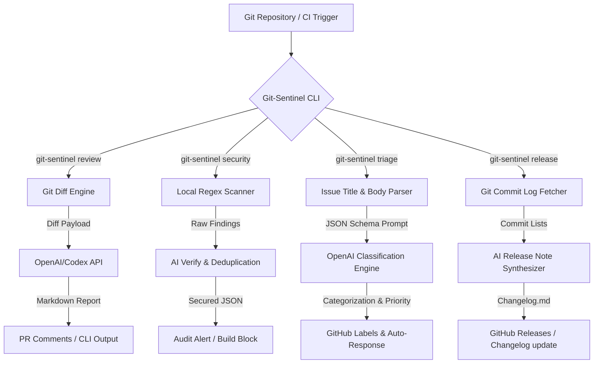

# 🛡️ Git-Sentinel

[](https://opensource.org/licenses/MIT)
[](https://github.com/erdemcakilci/git-sentinel/actions)
[](https://openai.com/)
[](https://nodejs.org/)

**Git-Sentinel** is an AI-powered git repository maintenance companion, CLI tool, and GitHub Action. It automates common code review practices, security checks, issue classification, and release compilation. 

Designed specifically to reduce maintainer fatigue, Git-Sentinel sits directly inside your development loop and CI/CD pipelines to keep your codebases secure, readable, and perfectly cataloged.

---

## 🚀 Key Features

*   **🔍 AI-Powered Code Review (`review`)**: Generates automated, constructive comments on git diffs, rating quality, security readiness, and providing contextual improvements.
*   **🛡️ Multi-Layer Security Scanner (`security`)**: Audits files for hardcoded secrets (API keys, DB credentials) and security vulnerabilities (dangerous eval, insecure HTTP calls), verifying results via local regex patterns and AI filtering.
*   **🏷️ Issue Triager & Classifier (`triage`)**: Automates labeling, priority estimation, and suggestions for incoming issues. Perfect for integrating with GitHub webhook web services.
*   **📝 Release Synthesizer (`release`)**: Automatically parses Conventional Commits and generates beautiful markdown changelogs with categorized changes and list of contributors.

---

## 📊 System Architecture



---

## 🛠️ Installation

```bash
# Clone the repository
git clone https://github.com/erdemcakilci/git-sentinel.git
cd git-sentinel

# Install dependencies
npm install

# Build the project
npm run build

# Link globally to use command line
npm link
```

---

## ⚙️ Configuration

Create a `.env` file in the root of your project or export the environment variables globally:

```env
# Required for AI operations
OPENAI_API_KEY=your_openai_api_key

# Optional (Defaults to gpt-4-turbo)
OPENAI_MODEL=gpt-4-turbo
```

---

## 📖 CLI Usage Reference

### 1. Code Review
Analyze changes between your current branch and the main branch:
```bash
git-sentinel review --target main
```

### 2. Security Audit
Audit files in your project. Add `--ai` to verify findings using AI (minimizing false positives in tests/examples):
```bash
git-sentinel security --ai
```

### 3. Issue Triage
Analyze issue descriptions to automatically determine labeling and priority:
```bash
git-sentinel triage --title "CRITICAL: Database connection pool leak on server start" --body "The server crashes after 50 connections with error: Max Pool Size Reached. Need to release connections in the finally block."
```

### 4. Release Notes Compilation
Synthesize release notes between the previous git tag and the current state:
```bash
git-sentinel release --version-name v1.2.0
```
Or specify a specific commit range:
```bash
git-sentinel release --version-name v1.2.0 --from v1.1.0 --to HEAD
```

---

## 🤖 Integration as a GitHub Action

You can configure Git-Sentinel directly inside your repositories to execute automatically on Pull Requests and Issue creation:

Create `.github/workflows/sentinel.yml`:
```yaml
name: Git-Sentinel Guard

on:
  pull_request:
    branches: [ main ]
  issues:
    types: [ opened ]

jobs:
  sentinel-review:
    runs-on: ubuntu-latest
    steps:
      - uses: actions/checkout@v4
        with:
          fetch-depth: 0
          
      - name: Setup Node.js
        uses: actions/setup-node@v4
        with:
          node-version: 20
          
      - name: Install & Build Sentinel
        run: |
          npm ci
          npm run build
          npm link
          
      - name: Run PR Review
        if: github.event_name == 'pull_request'
        env:
          OPENAI_API_KEY: ${{ secrets.OPENAI_API_KEY }}
        run: git-sentinel review --target ${{ github.base_ref }}

      - name: Security Scan
        env:
          OPENAI_API_KEY: ${{ secrets.OPENAI_API_KEY }}
        run: git-sentinel security --ai
```

---

## 🤝 Contributing

We welcome community contributions! Please review our [CONTRIBUTING.md](file:///Users/Erdem/Desktop/hhh/CONTRIBUTING.md) to understand our branching strategy, code style guide, and tests checklist.

---

## 📜 License

This project is licensed under the MIT License - see the [LICENSE](file:///Users/Erdem/Desktop/hhh/LICENSE) file for details.
